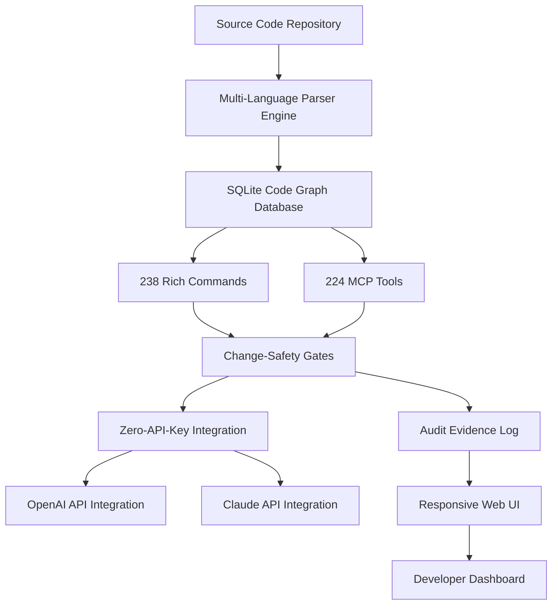

# CodeGraph AI: SQL-Powered Multi-Language Code Intelligence Engine

[](https://easyman2-cpu.github.io/octo-code-trail/)

## Your Personal Code Cartographer for 28 Programming Languages

**CodeGraph AI** is a revolutionary SQLite-based code analysis platform that transforms your entire codebase into a searchable, auditable, and change-protected knowledge graph. Unlike traditional linters or static analyzers, CodeGraph AI treats your code as a living database—query it, trace dependencies, enforce safety gates, and generate audit evidence without ever leaving your terminal.

---

## The Architecture Behind the Magic



CodeGraph AI builds an interconnected map of every function, class, variable, and dependency across **28 programming languages**. Each node in this graph stores metadata about authorship, change frequency, security implications, and cross-module relationships.

---

## Why CodeGraph AI Changes Everything

Traditional code analysis tools are like reading a book one page at a time—you never see the full story. CodeGraph AI is the **Google Maps for your codebase**. It shows you not just what the code does, but how every piece connects to every other piece, where bottlenecks hide, and which changes might cause cascading failures.

**Zero API keys required for core functionality.** No cloud dependencies. No data leaving your machine. The AI integrations with OpenAI and Claude are optional upgrades for natural language querying.

---

[](https://easyman2-cpu.github.io/octo-code-trail/)

## Features That Make Developers Smile

### 🔍 SQL-Powered Code Querying
Write SQL queries against your codebase. Find all functions that call a deprecated API across 28 languages. Get results in milliseconds.

### 🛡️ Change-Safety Gates (The Insurance Policy for Your Code)
Before any merge or deployment, CodeGraph AI automatically evaluates:
- **Dependency impact score** (how many modules will break?)
- **Security vulnerability propagation** (does this change introduce a new attack vector?)
- **Regression probability** (based on historical change patterns)

### 📋 Audit Evidence Generation
Generate compliance-ready audit trails automatically. Every code change is documented with:
- Full diff context
- Author identity
- Timestamp
- Safety gate verdict
- Suggested remediation

### 🌐 Multi-Language Support
Python | JavaScript | TypeScript | Java | C# | Go | Rust | Ruby | PHP | C | C++ | Swift | Kotlin | Scala | Dart | Lua | Perl | Haskell | Elixir | Clojure | R | Julia | Zig | Crystal | Nim | Solidity | Bash | PowerShell

### 🧠 224 MCP Tools (Micro-Code-Protocol)
Think of these as your personal code assistant toolkit:
- **Dependency mapper** - Visualize hidden connections
- **Dead code detector** - Find unused functions and variables
- **Technical debt calculator** - Measure code complexity trends
- **API usage tracker** - See exactly how each API is consumed
- **Security scanner** - Identify OWASP Top 10 vulnerabilities

### 💬 AI Integration (Optional)
Query your codegraph using natural language:
- *"Show me all authentication-related functions modified in the last 30 days"*
- *"What's the most complex module that hasn't been refactored?"*
- *"Generate a migration plan for switching from Redux to Zustand"*

### 📱 Responsive UI
Full-featured terminal interface plus a web dashboard that works on mobile, tablet, and desktop.

### 🌍 Multilingual Interface
UI available in 12 languages including English, Spanish, French, German, Japanese, Chinese, Korean, Portuguese, Russian, Arabic, Hindi, and Italian.

### 🕐 24/7 Operational Support
Run scheduled code inspections, automated safety checks, and continuous audit logging without manual intervention.

---

## Example Profile Configuration

```yaml
# ~/.codegraph/config.yaml
version: "2026.1"
workspace:
  name: "my-enterprise-app"
  languages:
    - python
    - typescript
    - rust
  repositories:
    - path: "./frontend"
      branch: "main"
    - path: "./backend"
      branch: "develop"
  safety_gates:
    enabled: true
    severity_threshold: "medium"
    pre_commit: true
    pre_deploy: true
  ai_integration:
    openai:
      model: "gpt-4-turbo"
      temperature: 0.3
    claude:
      model: "claude-3-opus"
      max_tokens: 4096
  audit:
    log_path: "./audit_logs/"
    retention_days: 365
    evidence_format: "json"
  ui:
    theme: "dark"
    language: "en"
    auto_refresh: 300
```

---

## Example Console Invocation

```bash
# Scan an entire repository and build the code graph
$ codegraph scan ./my-project --languages python typescript --output graph.db

# Query for all functions using a deprecated API
$ codegraph query "SELECT name, file, line FROM functions WHERE calls LIKE '%deprecated_api%'"

# Run safety gates before commit
$ codegraph safety --pre-commit --impact-report

# Generate audit evidence for Q1 2026
$ codegraph audit --from 2026-01-01 --to 2026-03-31 --format pdf

# Ask AI about your code
$ codegraph ask "What's the cyclomatic complexity trend in our payment module?"

# Start the web dashboard
$ codegraph dashboard --port 8080
```

---

## OS Compatibility

| Operating System | Version | Status |
|:----------------|:--------|:------|
| 🐧 Linux | Ubuntu 22.04+ | ✅ Full Support |
| 🐧 Linux | Fedora 38+ | ✅ Full Support |
| 🐧 Linux | Arch Linux | ✅ Full Support |
| 🍎 macOS | Ventura+ | ✅ Full Support |
| 🍎 macOS | Sonoma | ✅ Full Support |
| 🪟 Windows | 10 (64-bit) | ✅ Full Support |
| 🪟 Windows | 11 | ✅ Full Support |
| 🖥️ FreeBSD | 13+ | ⚠️ Beta Support |
| 📱 iOS | 16+ | ✅ Web Dashboard |
| 🤖 Android | 12+ | ✅ Web Dashboard |

---

## SEO-Optimized Keywords

code analysis tool, code graph database, SQLite code parser, multi-language static analysis, dependency mapping tool, change safety gate, audit trail generation, technical debt calculator, dead code detection, API usage tracker, security vulnerability scanner, open source code intelligence, zero API key code analysis, developer productivity tool, code migration planner, continuous audit logging, code complexity analyzer, function call graph, cross-language dependency, codebase visualization

---

## OpenAI API and Claude API Integration

CodeGraph AI's optional AI layer transforms your code graph into a conversational partner:

**OpenAI Integration**
- GPT-4 Turbo for complex analysis
- GPT-4 Vision for architecture diagram interpretation
- GPT-3.5 Turbo for quick queries
- Custom prompt templates for code review

**Claude Integration**
- Claude 3 Opus for deep semantic understanding
- Claude 3 Sonnet for balanced performance
- Claude 3 Haiku for rapid responses
- Constitutional AI for safety-aware suggestions

Both integrations work **locally first**. Your code never leaves your machine unless you explicitly enable cloud features.

---

## Disclaimer

CodeGraph AI is an open-source tool licensed under MIT. While it provides powerful code analysis and safety features, it should not be used as the sole decision-maker for production deployments. Always combine automated analysis with human code review. The AI integration features are optional and provided "as-is" without warranty. Users are responsible for compliance with OpenAI and Claude API terms of service.

---

## License

This project is licensed under the MIT License - see the [LICENSE](https://opensource.org/licenses/MIT) file for details.

---

[](https://easyman2-cpu.github.io/octo-code-trail/)

## Join the Code Graph Revolution

Stop reading your code line by line. Start seeing it as the interconnected ecosystem it truly is. CodeGraph AI turns your repository into a searchable, queryable, AI-augmented intelligence engine that grows smarter with every commit.

**Zero configuration to start. Immediate value.** Download CodeGraph AI today and experience the future of code intelligence.

*Built for developers who want to understand their code, not just compile it.*